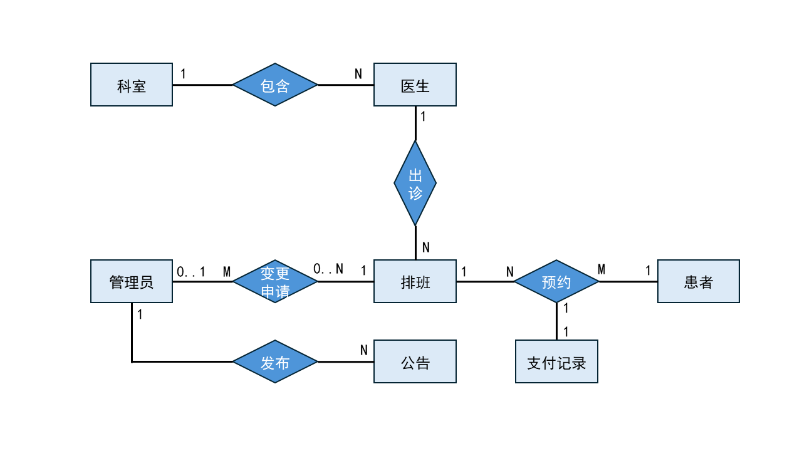

# 医院预约挂号系统 (Hospital Appointment System)

数据库课程设计项目，围绕"排班发布 → 患者查询 → 挂号预约 → 模拟支付 → 状态管理"闭环，构建一个核心的医院预约挂号数据库驱动系统。

**项目成员：** 狄东琛（后端）、肖国扬（前端）、范骐鸣（数据库/SQL）

## 系统功能

系统面向三类用户角色，各自拥有不同权限：

| 角色 | 功能 |
|------|------|
| **患者 (Patient)** | 注册/登录、浏览科室与医生、按日期/时段查询排班与号源（含挂号费）、预约挂号（自动生成排队号）、模拟支付、查看/取消预约（退费）、查看支付记录、查看系统公告、个人中心 |
| **医生 (Doctor)** | 登录、个人资料维护（头像上传、擅长领域、修改密码）、查看自己的排班（含状态）、查看预约患者名册（按排队号排序）、完成就诊、发起排班变更申请（停诊/修改）、查看/撤回申请 |
| **管理员 (Admin)** | 登录、科室 CRUD 与启停管理、医生 CRUD 与启停管理、排班管理、排班变更审核（乐观锁）、支付记录查看、系统公告管理、数据看板 |

### 核心业务流程

```
管理员发布排班 → 患者查询可预约排班(剩余号源+挂号费) → 选择时段预约(生成排队号+待支付记录)
                                                           ↓
                                                    患者模拟支付 → pay_status 更新
                                                           ↓
                                                    患者取消 → 号源回补 + 已支付自动退款
                                                           ↓
                                                    医生完成就诊 → 状态更新
```

```
医生发起停诊/修改排班申请 → 管理员审核(乐观锁) → 通过后自动调整排班
```

预约创建与取消、支付、排班变更审核均使用数据库事务（`@Transactional`）保证原子性。

## 技术栈

### 前端
| 技术 | 说明 |
|------|------|
| Vue 3.5 | Composition API |
| Vite 5 | 构建工具 |
| Element Plus 2.8 | UI 组件库（按需自动导入） |
| Vue Router 4 | 前端路由（按角色分组） |
| Pinia 2 | 状态管理 |
| Axios | HTTP 请求 |
| Sass | CSS 预处理 |

### 后端
| 技术 | 说明 |
|------|------|
| Java 17 | 运行环境 |
| Spring Boot 3.2.5 | 应用框架 |
| MyBatis-Plus 3.5.5 | ORM |
| MySQL 8.0 | 关系型数据库 |
| Maven | 项目构建 |
| SpringDoc OpenAPI 2.5 | API 文档（Swagger） |
| BCrypt | 密码哈希 |
| Spring Validation | 参数校验 |

## 数据库概况

共 9 张表 + 2 个查询视图，字符集 utf8mb4，引擎 InnoDB。

### ER 关系



- **科室 → 医生**：1:N（一个科室多名医生，一名医生归属一个科室）
- **医生 → 排班**：1:N（一名医生多条排班，一条排班属于一名医生）
- **患者 ↔ 排班**：M:N，通过 **Appointment** 中间表拆解
- **预约 ↔ 支付记录**：1:1（一条预约对应一条挂号费支付记录）
- **排班 → 变更申请**：1:N（一条排班可被多次申请变更）

### 表结构

#### 基础信息模块

| 表名 | 主键 | 核心字段 | 说明 |
|------|------|----------|------|
| `department` | dept_id (INT, AUTO) | dept_name (UNIQUE), location, description, **status** (1正常/0停用) | 科室信息，停用后患者端不可见 |
| `doctor` | doc_id (INT, AUTO) | doc_name, gender (CHECK M/F), title, dept_id (FK), password (BCrypt), **avatar_url, specialty, status** (1正常/0停用) | 医生信息，停用后禁止登录 |
| `patient` | patient_id (INT, AUTO) | id_card (UNIQUE, CHAR 18), real_name, gender, phone, password (BCrypt) | 患者信息 |
| `admin_user` | admin_id (INT, AUTO) | username (UNIQUE), real_name, password (BCrypt), **status** (1正常/0停用) | 管理员账号，密码 BCrypt 哈希 |

#### 排班与预约模块

| 表名 | 主键 | 核心字段 | 说明 |
|------|------|----------|------|
| `schedule` | schedule_id (INT, AUTO) | doc_id (FK), work_date, shift (CHECK 上午/下午/夜诊), total_quota, rest_quota, **fee** (挂号费), **status** (1正常/0停诊) | 排班号源，停诊后不可预约 |
| `appointment` | appt_id (INT, AUTO) | patient_id (FK), schedule_id (FK), **queue_number** (排队号, UNIQUE), status (1已预约/2已取消/3已就诊/4已过期), **cancel_reason, create_time, update_time** | 挂号记录 |
| `payment_record` | payment_id (INT, AUTO) | appt_id (FK, UNIQUE), amount, pay_status (0待支付/1已支付/2已关闭/3已退款), pay_method, pay_time | 挂号费模拟支付，不调用真实支付接口 |

#### 排班变更审核模块

| 表名 | 主键 | 核心字段 | 说明 |
|------|------|----------|------|
| `schedule_change_request` | request_id (INT, AUTO) | schedule_id (FK), change_type (1停诊/2修改), target_work_date, target_shift, target_total_quota, reason, status (1待审核/2已通过/3已驳回/4已撤回), audit_admin_id, audit_time, audit_remark | 医生发起停诊或修改排班申请，管理员审核 |

#### 公告模块

| 表名 | 主键 | 核心字段 | 说明 |
|------|------|----------|------|
| `sys_notice` | notice_id (INT, AUTO) | title, content, is_top (1置顶/0否), status (1发布/0下线), publish_time, admin_id (FK) | 系统公告，患者端仅展示已发布 |

#### 查询视图

| 视图 | 说明 |
|------|------|
| `v_appointment_detail` | 预约详情视图，联表查询预约、患者、排班、医生、科室、支付信息 |
| `v_available_schedule` | 可预约排班视图，过滤停用科室/医生、停诊排班、已约满号源 |

### 关键状态码

| 领域 | 状态值 |
|------|--------|
| 科室/医生/管理员 | 1=正常, 0=停用 |
| 排班 | 1=正常, 0=停诊 |
| 预约 | 1=已预约, 2=已取消, 3=已就诊, 4=已过期 |
| 支付 | 0=待支付, 1=已支付, 2=已关闭, 3=已退款 |
| 排班变更 | 1=待审核, 2=已通过, 3=已驳回, 4=已撤回 |

关键约束：`schedule.rest_quota >= 0 AND <= total_quota`；`appointment.queue_number > 0` 且同一排班唯一；`fee >= 0`；`amount >= 0`；女性用 CHECK 约束保证数据完整性。

## 运行方式

### 1. 环境要求

- **JDK 17** 及以上
- **Maven 3.8** 及以上
- **MySQL 8.0** 及以上（需提前运行）
- **Node.js 18** 及以上

### 2. 数据库准备

```bash
# 创建数据库
mysql -u root -p -e "CREATE DATABASE IF NOT EXISTS hospital_db DEFAULT CHARSET utf8mb4 COLLATE utf8mb4_unicode_ci;"

# 导入建表脚本
mysql -u root -p --default-character-set=utf8mb4 hospital_db < sql/schema.sql

# 导入测试数据（10科室/13医生/20患者/2管理员/75排班/84预约）
mysql -u root -p --default-character-set=utf8mb4 hospital_db < sql/data.sql
```

### 3. 启动后端

```bash
cd backend

# 修改 src/main/resources/application.yml 中的数据库用户名/密码
# 默认为 root / 123456，根据本地环境调整

mvn spring-boot:run
```

后端启动在 `http://localhost:8080`，Swagger 文档在 `http://localhost:8080/swagger-ui.html`。

> **注意：** `application.yml` 中 `spring.sql.init.mode` 当前为 `never`，需手动执行 SQL 脚本初始化数据。

### 4. 启动前端

```bash
cd frontend

npm install
npm run dev
```

前端开发服务器在 `http://localhost:5173`，API 请求自动代理到 `http://localhost:8080`。

### 5. 测试账号

| 角色 | 用户名/ID | 密码 |
|------|-----------|------|
| 管理员 | admin1 / admin2 | admin123 |
| 医生 | 1～13（doc_id） | 123456 |
| 患者 | 1～20（patient_id） | 123456 |

## 仓库主要文件

```
├── README.md                         # 项目入口说明（本文件）
├── .gitignore
├── sql/                              # 数据库脚本（独立维护版）
│   ├── schema.sql                    #   建表 DDL（9表+2视图+索引）
│   ├── data.sql                      #   测试数据
│   └── queries.sql                   #   核心查询 SQL 示例
├── docs/                             # 项目文档
│   ├── 项目需求说明.md                #   需求定义、角色、实体、关系、功能
│   ├── 关系模式设计.md                #   ER 图→关系模式、范式分析
│   ├── 数据库逻辑结构.md              #   表定义、约束、索引方案
│   ├── 数据库设计课堂实践方案.md       #   课程项目说明书
│   ├── 开发指导文档.md                #   团队分工、API 契约、任务清单
│   ├── 前端技术文档.md                #   前端架构与设计决策
│   ├── 前端UI设计.md                  #   UI 设计方案与线框图
│   ├── 数据库测试与问题解决报告.md     #   故障排查实录
│   ├── 自我测试说明.md                #   SQL 测试用例
│   ├── 新增功能规划.md                #   新功能需求规划
│   ├── 升级方案-数据库设计.md          #   数据库升级设计文档
│   └── ER图.png                      #   ER 图
├── backend/                          # Spring Boot 后端
│   ├── pom.xml
│   └── src/main/
│       ├── java/com/hospital/        #   源码（按 controller/service/mapper/entity/dto 分层）
│       └── resources/
│           ├── application.yml       #   应用配置（数据库、端口）
│           ├── schema.sql            #   建表脚本（应用启动执行版）
│           ├── data.sql              #   测试数据（应用启动执行版）
│           └── static/avatars/       #   医生头像图片
└── frontend/                         # Vue 3 前端
    ├── package.json
    ├── vite.config.js
    ├── .env.development / .env.production
    ├── index.html
    └── src/
        ├── main.js / App.vue         #   入口
        ├── api/                      #   按模块拆分的 API 封装 + Axios 实例
        ├── router/                   #   路由表（按角色分组）+ 权限守卫
        ├── stores/                   #   Pinia 用户状态
        ├── layouts/                  #   布局组件
        ├── views/                    #   页面（按角色分 patient/doctor/admin）
        ├── components/               #   通用组件
        ├── utils/                    #   工具函数（常量、校验、存储）
        └── styles/                   #   全局样式与 CSS Token
```

## API 接口概览

所有接口统一返回 `{ code, message, data }`，认证方式为请求头 `Authorization: Bearer <token>`。

### 公开接口

| 方法 | 路径 | 说明 |
|------|------|------|
| POST | `/api/patients/register` | 患者注册 |
| POST | `/api/patients/login` | 患者登录 |
| POST | `/api/doctors/login` | 医生登录 |
| POST | `/api/admin/login` | 管理员登录 |
| GET | `/api/departments` | 科室列表（仅展示正常科室） |
| GET | `/api/departments/{deptId}` | 科室详情 |
| GET | `/api/departments/{deptId}/doctors` | 科室下医生（仅展示正常医生） |
| GET | `/api/schedules` | 可预约排班查询（按科室/日期/时段，过滤停诊/约满） |
| GET | `/api/notices` | 系统公告列表（仅已发布，置顶优先） |
| GET | `/api/notices/{noticeId}` | 公告详情 |

### 患者接口（需 PATIENT 角色）

| 方法 | 路径 | 说明 |
|------|------|------|
| POST | `/api/appointments` | 预约挂号（生成排队号 + 待支付记录，事务） |
| PUT | `/api/appointments/{id}/cancel` | 取消预约（可选 cancelReason，已支付自动退款） |
| POST | `/api/appointments/{id}/pay` | 模拟支付挂号费 |
| GET | `/api/appointments/patients/{id}` | 我的预约（含支付状态、排队号） |
| GET | `/api/patients/me` | 个人资料 |
| PUT | `/api/patients/me` | 修改个人资料 |
| PUT | `/api/patients/me/password` | 修改密码 |
| GET | `/api/patients/me/payments` | 我的支付记录 |

### 医生接口（需 DOCTOR 角色）

| 方法 | 路径 | 说明 |
|------|------|------|
| GET | `/api/doctors/me` | 个人资料 |
| PUT | `/api/doctors/me` | 修改资料（头像 URL、擅长领域） |
| PUT | `/api/doctors/me/password` | 修改密码 |
| POST | `/api/doctors/me/avatar` | 上传头像（multipart） |
| GET | `/api/doctors/{id}/schedules` | 我的排班（含状态、剩余号源） |
| GET | `/api/doctors/schedules/{id}/patients` | 排班患者名册（按排队号排序） |
| PUT | `/api/appointments/{id}/finish` | 完成就诊 |
| POST | `/api/doctors/schedules/{id}/change-request` | 发起排班变更申请（停诊/修改） |
| GET | `/api/doctors/change-requests` | 我的变更申请列表 |
| PUT | `/api/doctors/change-requests/{id}/withdraw` | 撤回待审核申请 |

### 管理员接口（需 ADMIN 角色）

| 方法 | 路径 | 说明 |
|------|------|------|
| CRUD | `/api/admin/departments` | 科室管理（含全部科室） |
| PUT | `/api/admin/departments/{id}/status` | 启用/停用科室（校验未来排班） |
| CRUD | `/api/admin/doctors` | 医生管理（含全部医生、头像、擅长领域） |
| PUT | `/api/admin/doctors/{id}/status` | 启用/停用医生 |
| CRUD | `/api/admin/schedules` | 排班管理（含挂号费维护） |
| GET | `/api/admin/change-requests` | 排班变更申请列表 |
| GET | `/api/admin/change-requests/{id}` | 申请详情 |
| PUT | `/api/admin/change-requests/{id}/approve` | 审核通过/驳回（乐观锁 + 事务自动更新排班） |
| GET | `/api/admin/payments` | 支付记录查看（按状态/时间筛选） |
| GET | `/api/admin/notices` | 公告管理列表 |
| POST | `/api/admin/notices` | 新增公告 |
| PUT | `/api/admin/notices/{id}` | 编辑公告 |
| PUT | `/api/admin/notices/{id}/offline` | 下线公告 |

## 认证机制

基于内存 Token 的认证方式：登录时服务端生成 UUID Token 存入 `ConcurrentHashMap`，客户端后续请求在 `Authorization` 头携带 `Bearer <token>`，由 `TokenInterceptor` 校验。Token 在服务重启后全部失效，需重新登录。密码使用 BCrypt 哈希存储。

管理员账号由 `admin_user` 表管理，不再使用配置文件硬编码。
